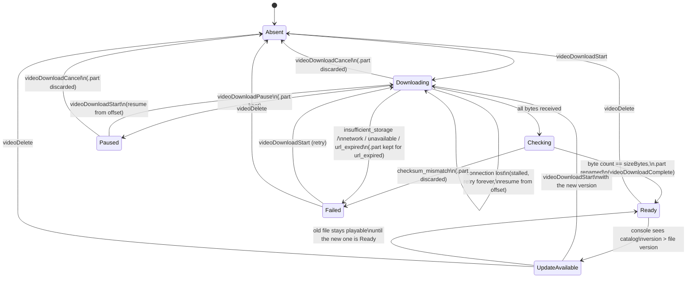
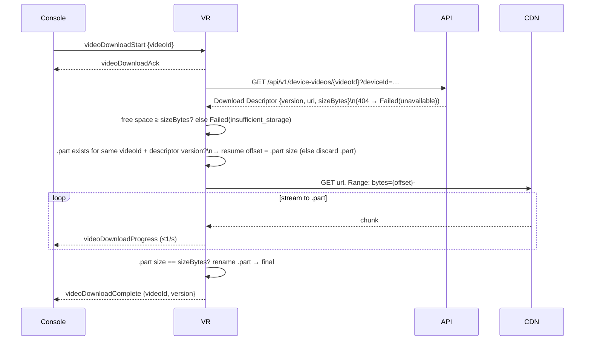
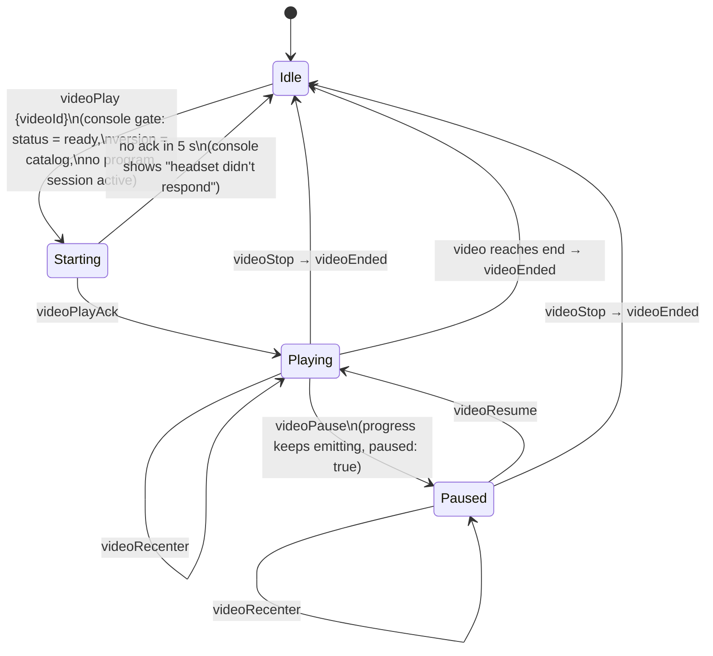
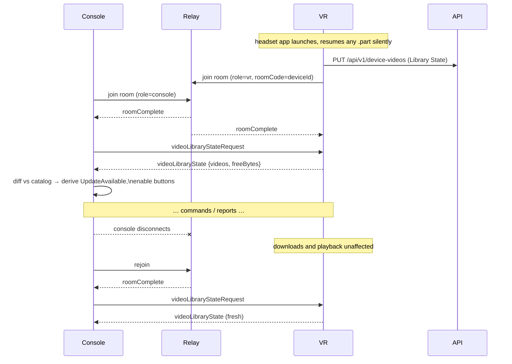
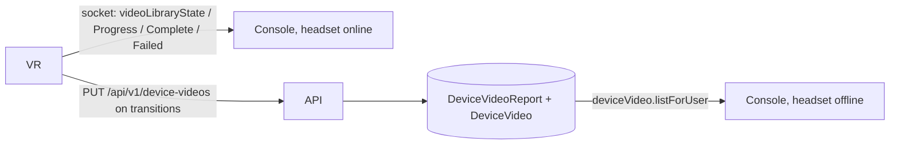

# Immersive Video: Lifecycles

**Status:** Accepted (VR team sign-off pending; changes return as a new ticket); companion to [immersive-video-shared-contract.md](./immersive-video-shared-contract.md). Decisions recorded in [ADR 0009](../adr/0009-headset-owned-video-library-mirror.md) and [ADR 0010](../adr/0010-immersive-video-cdn-byte-path-relay-control-path.md).  
**Applies to:** Adminboard, platform API, console, socket relay, VR client  
**Scope:** How an Immersive Video moves through the system over time: from admin upload to a physio pressing play, and what every interruption does to that state. The contract document defines the wire events; this document defines the states those events move between and who owns each transition.

Domain terms: **Immersive Video**, **Catalog State**, **Version** (`apps/adminboard/CONTEXT.md`); **Headset Library** (videos present on one headset, keyed by **Headset Identity**), **Library State** (the headset's report), **Download Request** (physio-initiated fetch), **Update Available**, **Not in catalog** (`apps/console/CONTEXT.md`); **Library Mirror** (the headset-written `DeviceVideoReport` + `DeviceVideo` cache of Library State in Postgres) and **Download Descriptor** (`services/server/CONTEXT.md`).

Five lifecycles interlock:

| Lifecycle                   | Owner of truth | Where state lives                  |
| --------------------------- | -------------- | ---------------------------------- |
| Catalog                     | Admin          | `ImmersiveVideo` (Postgres) + S3   |
| Headset library (per video) | Headset        | Files on the headset's disk        |
| Download request            | Headset        | In-memory queue + `.part` on disk  |
| Playback                    | Headset        | In-memory                          |
| Room connection             | Socket relay   | `RoleSlotRoomRegistry` (in-memory) |

The Library Mirror is not a lifecycle of its own; it is a projection of the headset library lifecycle and is described at the end.

---

## 1. Catalog lifecycle

```mermaid
stateDiagram-v2
    [*] --> Draft : admin opens the create dialog\n(empty row, no file)
    Draft --> Uploading : admin picks a file\n(Video Upload starts)
    Uploading --> Verifying : CompleteMultipartUpload
    Uploading --> Draft : admin cancels the upload\n(prior state restored)
    Verifying --> Draft : HeadObject length matches\n(file, sizeBytes, S3 checksum, version recorded)
    Verifying --> Draft : length mismatch\n(object deleted, row notice, no file)
    Draft --> Published : admin publishes\n(requires file, checksum, thumbnail;\npublishedAt set)
    Published --> Published : metadata edit\n(title, activity, description, thumbnail)
    Published --> Republishing : admin replaces the file\n(Video Upload onto the live key)
    Republishing --> Published : verified: same objectKey,\nnew checksum, version + 1
    Republishing --> Unpublished : length mismatch on the live key\n(object deleted, no file)
    Republishing --> Published : admin cancels the replace\n(version unchanged)
    Published --> Unpublished : admin unpublishes\n(publishedAt cleared)
    Unpublished --> Published : admin republishes
    Unpublished --> Uploading : admin replaces the file
    Unpublished --> [*] : admin deletes\n(row + objects removed)
    Draft --> [*] : admin deletes\n(or discardIfEmpty on dialog close)
    Published --> [*] : admin deletes
```

Rules:

- **The adminboard never talks to S3.** A **Video Upload** goes browser → `services/server` → S3 as server-owned multipart in 64 MiB sequential parts, resumable via `ListParts`; one upload per browser tab.
- **Integrity is settled on ingest.** Every part is uploaded with `ChecksumAlgorithm: SHA256`, so S3 rejects a part whose bytes do not match what the server sent, and `CompleteMultipartUpload` records a composite checksum on the object. `Verifying` is one `HeadObject`: `ContentLength` must equal the size the admin's browser reported and the composite checksum must be present; the checksum is stored on the row as the record of that check. It never reaches a headset (ADR 0011). On mismatch the object is deleted and the row returns to `Draft` (or, for a republish that overwrote the live key, drops to `Unpublished`) with no file and a persistent row notice.
- **A `Draft` may not yet have a file.** Publish requires `objectKey`, `checksum` and a thumbnail; the Publish action is disabled with a tooltip naming the missing precondition.
- `version` starts at `0` (no verified object yet); the first successful verify writes `1`. It bumps **only** on a file replace, never on a metadata edit. This is what lets a headset tell "same video, newer file" from "same video, new title".
- **One object per video.** The key is `immersive-videos/{id}.{ext}` (the picked extension); a replace is a multipart upload onto the **same key**, and S3 swaps the bytes at `CompleteMultipartUpload`. A replace that changes extension deletes the previous key once the new one verifies. There are no retired objects and no object sweep; versioned keys return with versioned distribution. Because the URL is stable, the Download Descriptor appends `?v={version}` so CloudFront caches each version separately (ADR 0011). A headset mid-download of the previous version sees a length mismatch and reports `checksum_mismatch`; the physio's next Download starts the new version.
- **Two File Kinds, no encoding constraint.** The adminboard picker defaults to **Unity AssetBundle** (`.bundle`, one video per bundle, built for Android from the headset project) and also accepts raw video (`mp4, m4v, mov, webm, mkv`). The kind is not stored; the object key's extension is what the headset branches on. Nothing on the platform inspects the file, and a bundle's Unity-version/target compatibility is the VR team's to keep. `durationSec` is read in the browser for raw video only; bundles leave it blank.
- **The Video ID may be admin-chosen, once.** The first upload for a row may carry a `videoId` (`^[a-z0-9][a-z0-9._-]{0,63}$`, unique); the row is renamed before the multipart upload is created, so the object key, the console catalog and every headset agree on it. Blank keeps the generated cuid. Once a file has verified (`version ≥ 1`) the id is locked: headsets may hold files under it.
- Only `Published` rows are returned by `immersiveVideo.list`, and the Download Descriptor is served for `Published` and `Republishing` (the last verified version). A video that is `Unpublished` or deleted disappears from the console catalog; a headset that already holds it reports it as before, and the console renders that entry as **Not in catalog**: Play disabled, Delete offered. Unpublished and deleted are deliberately indistinguishable to the physio. A republished **new version** is the ordinary **Update Available** path.
- Deleting a video removes the row, its objects and the matching Library Mirror rows in the API (there is no foreign key from `DeviceVideo` to the catalog; a later headset report may re-insert the id). The console **never** auto-sends `videoDelete`; the physio removes the file from each headset from the **Not in catalog** row.

## 2. Headset library lifecycle (one video on one headset)

This is the core state machine. It lives on the headset; everything the console shows is a reflection of it.

Notes on the less obvious transitions:

- **`Checking` is a sub-state of `downloading` on the wire.** The headset counts bytes while streaming and compares the total with `sizeBytes` at EOF (no content hash reaches it); it reports `downloading` until the rename is done. It is named `Checking` here to keep it apart from the catalog's server-side `Verifying`.
- **`UpdateAvailable` is a console-derived state.** The headset only knows the `version` it has on disk; it never sees the catalog. The console computes `UpdateAvailable` by comparing Library State against `immersiveVideo.list`. On the wire the headset still reports `ready` with its version.
- **Updating does not delete the old file first.** The new version downloads to a separate `.part`; only on `Ready` does the headset swap files. If the update fails, the old version is still `Ready` and playable. This costs temporary double storage, which is why the console must check `freeBytes` against `sizeBytes` before sending an update.
- **Connection loss is not `Failed`.** Wifi drop, sleep, and relaunch all keep the entry `downloading`; the headset retries with capped backoff and resumes from the `.part` offset by itself, reporting `stalled: true` while a console is watching. `Failed(network)` is reserved for non-recoverable errors.
- **`Paused` is the physio's stop.** It keeps the `.part` but is _never_ auto-resumed: that is the only difference between a `paused` and a `downloading` `.part` on disk. Resume is the same `videoDownloadStart` the console sent originally.
- **`Failed` keeps its `.part` only for `url_expired`**, which the headset reports only after it has already refreshed the Download Descriptor once and the CDN still refused; the physio's next Download resumes with `Range`. `insufficient_storage`, `checksum_mismatch`, `network` and `unavailable` discard it.
- **`Absent` after `videoDelete` is immediate** from the console's point of view; the headset removes the file asynchronously and reports the new Library State when done.

## 3. Download request lifecycle

A Download Request is the headset's unit of work. It starts at `videoDownloadStart {videoId}`, begins with the headset fetching the **Download Descriptor** for that video, and ends at `Complete`, `Failed`, or `Cancel`. What makes it interesting is what happens when something in the environment changes mid-request.

### Interruptions

| Interruption                                                           | Headset does                                                                                                                                                                                                                               | Console sees                                                                                                                                                                                                                                                                  |
| ---------------------------------------------------------------------- | ------------------------------------------------------------------------------------------------------------------------------------------------------------------------------------------------------------------------------------------ | ----------------------------------------------------------------------------------------------------------------------------------------------------------------------------------------------------------------------------------------------------------------------------- |
| Physio closes the console tab                                          | Nothing changes. HTTP download continues. Progress events go nowhere. On completion the headset `PUT`s its Library State to the API, so the Library Mirror is current without a console.                                                   | On next connect: `videoLibraryStateRequest` → current state (possibly already `ready`). Any other console viewing the headset offline already sees `ready` from the Library Mirror.                                                                                           |
| Console socket drops but tab stays open                                | Same as above.                                                                                                                                                                                                                             | Presence polling shows the headset; on room rejoin the console re-requests Library State.                                                                                                                                                                                     |
| Headset wifi drops                                                     | Stays `downloading`. Retries with exponential backoff (1 s → 30 s cap) for as long as the app runs; on success resumes with `Range` from the `.part` offset. Emits `videoDownloadProgress {stalled: true}` while a console is in the room. | "Waiting for headset connection…" replaces the rate. If the headset leaves the room, presence shows it offline; on rejoin the unsolicited `videoLibraryState` resumes the progress row. **No physio action.**                                                                 |
| Headset goes to sleep (app suspended)                                  | On suspend: abort the stream, flush `.part` and manifest. On wake: reconcile, resume every `downloading` entry from its offset, `PUT` Library State, rejoin the room. Same as a wifi drop from the console's side.                         | Headset offline for the nap; progress continues on wake. Library Mirror shows `downloading` in between.                                                                                                                                                                       |
| Physio presses Pause                                                   | `videoDownloadPause` → abort within 1 s, keep `.part`, manifest `paused`, reply `videoDownloadPaused {bytesDownloaded}`, `PUT` Library State. Not resumed on launch/wake.                                                                  | Row shows "Paused at 43 % · 2.1 GB left" with **Resume** and **Cancel**. Resume sends the same `videoDownloadStart {videoId}`; the headset re-fetches the descriptor and continues from the offset. Any other console (or the offline Library Mirror view) sees `paused` too. |
| Headset app is closed / headset reboots                                | `.part` survives on disk. On next app launch the headset **silently resumes** any `.part` (this is finishing a request the physio already made, not a new one).                                                                            | Library Mirror shows `downloading` (headset reports on launch). When a console next connects, live Library State shows the resumed byte count.                                                                                                                                |
| Headset storage fills during download                                  | `Failed(insufficient_storage)`, `.part` discarded.                                                                                                                                                                                         | `videoDownloadFailed {insufficient_storage}` → "Delete a video to free space."                                                                                                                                                                                                |
| Physio starts a regular program                                        | Download continues in the background (or the headset auto-suspends it and resumes after the session; VR team's call). It stays `downloading` on the wire either way. The program is never blocked.                                         | Progress may stall during the session. Console shows a small "downloading in background" note. If bandwidth hurts the session the physio presses Pause (one click, no prompt).                                                                                                |
| Physio presses Cancel                                                  | Abort HTTP (running, queued, or paused), discard `.part`, report `Failed(cancelled)`.                                                                                                                                                      | Row returns to `Absent`; no error copy shown.                                                                                                                                                                                                                                 |
| CDN rejects the URL (403/410)                                          | Re-fetch the Download Descriptor once. Same version → resume the `.part` with the new URL; new version → discard and restart. Still rejected → `Failed(url_expired)`, `.part` kept.                                                        | Nothing while the headset refreshes. On `url_expired`: the `network` copy ("The download failed. Try again.") with **Download**; a click resumes from the kept `.part`. The console has no URL-retry branch.                                                                  |
| Video unpublished/deleted, or headset unpaired, before the descriptor  | Descriptor `404` → `Failed(unavailable)`, `.part` discarded.                                                                                                                                                                               | "This video is no longer available." unless the row is already **Not in catalog**, which takes precedence.                                                                                                                                                                    |
| Second `videoDownloadStart` for a different video while one is running | Queued; `videoDownloadAck` sent immediately. Downloads run one at a time in order.                                                                                                                                                         | Second row shows `downloading` at 0 % with no progress until the first completes. Console may label it "queued".                                                                                                                                                              |
| `videoDownloadStart` for a video already `Ready` at that version       | No-op; `videoDownloadAck` then immediate `videoDownloadComplete`.                                                                                                                                                                          | Row stays `Ready`. (There is no "Download all missing" bulk action in v1.)                                                                                                                                                                                                    |

## 4. Playback lifecycle

Rules:

- **The console gates, the headset trusts.** `videoPlay` is only ever sent for an entry the console knows is `Ready` at the current version. The headset does not re-validate against the catalog (it can't). If the file is somehow missing, the headset answers with `videoEnded` immediately and the console re-requests Library State.
- **One playback at a time per headset.** A `videoPlay` while `Playing` or `Paused` is ignored by the headset; the console never offers it (the picker is disabled while active).
- **Unconfirmed `videoPlay`.** If no `videoPlayAck` arrives in 5 s, or the room goes incomplete first, the console opens the `HeadsetDidNotConfirmDialog` (reasons: didn't respond / disconnected) and never re-sends the command; the re-attach rule decides the panel on the next `roomComplete`.
- **Console disconnect during playback does not stop playback.** The patient keeps watching. Playback state is _not_ part of `videoLibraryState`; the headset keeps emitting `videoPlaybackProgress` (≤1/s, with `paused: true` while paused) whenever a console is in the room. **Re-attach rule:** on every `roomComplete` (rejoin, new tab, replacement survivor) the console waits **2 s** for a `videoPlaybackProgress`; `paused: false` → re-attach as Playing, `paused: true` → re-attach as Paused, nothing → Idle with the picker enabled.
- **Headset disconnect during playback:** the headset keeps playing (the file is local). The console's transport buttons disable until the room is complete again, then the same 2 s re-attach rule applies.
- **Program sessions and playback are mutually exclusive on one headset, and the console gates both.** The patient dashboard's `immersive` mode can be entered only while `programState === 'ready'`, and cannot be left while local playback is Starting/Playing/Paused ("Stop the video to change mode."). In the other modes, **video active on headset:** a `videoPlaybackProgress` received on this room within the last **3 s**, or local Starting, disables Start Session with the banner "A video is playing on this headset. Switch to Immersive Video mode to control it."
- **`videoRecenter` is stateless.** It re-aligns the 180° sphere to the current head yaw. It is valid in `Playing` and `Paused`, and safe to press repeatedly.
- **No session record is written** in v1. Start and end of playback are not persisted anywhere; the only trace is socket logs.

## 5. Room connection lifecycle

This is the existing relay lifecycle (`RoleSlotRoomRegistry`), restated for what the video feature does at each point.

Rules:

- **Every `roomComplete` on the console side triggers `videoLibraryStateRequest`.** Never cache Library State across a connection; the headset is the source of truth and re-asking is cheap. **Room membership is the only gate** for every command (`RoomComplete` → enabled, `MemberLeft`/disconnect → disabled). Presence polling only chooses the copy and data source while no room exists: poll offline → Library Mirror rows + "Turn the headset on and open the app to download videos."; poll online but room not complete → Library Mirror rows + "Connecting to headset…", buttons disabled. A stale poll never disables a live panel.
- **Unconfirmed `videoDownloadStart`.** The console keeps a per-tab marker until the room is complete again and never re-sends. If the room goes incomplete before the ack, or no ack arrives in 5 s, it opens the `HeadsetDidNotConfirmDialog` ("The headset disconnected before confirming the download. When it reconnects, check the list. If the video isn't downloading, click Download again." / "Headset didn't respond. Check it's on and the app is open."). On rejoin the fresh `videoLibraryState` decides the row silently.
- **Every `roomComplete` on the VR side triggers an unsolicited `videoLibraryState`** if a console is present. Belt and braces: whichever side connects second, the console ends up with fresh state.
- **Role Peer Replacement** (a second console tab opens for the same headset): the replaced console gets `replacementNotice` and shows a dashboard-wide dialog: "Another tab is now controlling this headset. Close this tab, or continue in the active one." (single **OK**, no take-over in v1). Behind it the tab freezes: library rows keep their last live values, every action is disabled, transport is disabled at the last position. It does **not** switch to the Library Mirror "as of" view or the "Waiting for headset connection…" copy: the headset is not offline, the tab is retired. The new console runs the normal join path. In-flight downloads are unaffected because the headset owns them.
- **Stale room eviction** (30 min cleanup) has no effect on headset state. A headset that was mid-download when its room was evicted still finishes; the next console to join gets the result.
- **No console in the room:** the headset still emits progress events into the room (they are dropped by the relay). This keeps the headset code simple: it never has to know whether anyone is listening.

## 6. The Library Mirror (`DeviceVideoReport` + `DeviceVideo`)

The Library Mirror is a write-behind cache of the headset library lifecycle, keyed by **Headset Identity**, written by the headset itself. It exists for exactly one reason: to show a physio what is on a headset that is currently **off**. See [ADR 0009](../adr/0009-headset-owned-video-library-mirror.md).

Rules:

- **The headset is the writer.** It `PUT`s its full Library State (`DeviceVideoReportBody`) to `/api/v1/device-videos` once on app launch and at every transition (download started, paused, completed, failed, video deleted). The server, in one transaction, upserts the `DeviceVideoReport` header (`freeBytes`, `reportedAt = now()`) for that Headset Identity and replaces its `DeviceVideo` rows. The console never writes the Library Mirror.
- **Snapshots, not deltas.** Every report is the whole library. The server stores `bytesDownloaded` when the snapshot carries it (a `downloading`/`paused` row shows the percentage); progress ticks never write the database.
- **Unknown `videoId`s are stored.** There is no foreign key from `DeviceVideo` to `ImmersiveVideo`; the headset may legitimately report a file the catalog no longer has, and the offline view stays honest until the physio deletes it.
- **Two paths, one purpose each.** The socket carries everything live and session-scoped (commands, progress, playback, Library State on `roomComplete`). The HTTP report carries only durable snapshots. Both run during an active download; neither replaces the other.
- **Failed reports are retried lazily.** If the `PUT` fails (no wifi, API down) the headset keeps the latest snapshot and retries on the next transition or network change. Because the console asks the headset directly whenever it is online, a missed report is only ever visible in the offline view.
- **Auth in v1:** the route is unauthenticated, like `POST /api/v1/device-pairing/claim`; it requires the Headset Identity to be on a non-deleted `Device`. No rate limit in v1. A pairing-issued device token (and rate limiting with it) can be added later without changing the body.
- **The Library Mirror is never read while the headset is online.** If the room is complete, the console renders from live Library State only. This avoids ever showing a stale `Ready` for a video the headset just deleted, and covers a report the headset failed to deliver.
- **When the headset is offline** the console renders Library Mirror rows with an explicit "as of {reportedAt}" and disables every action except viewing. A physio can see that Room 2 headset had three videos two days ago, but cannot send it a command.
- **Access:** a user can read Library Mirror rows only for Headset Identities on their own non-deleted `Device` records (`deviceVideo.listForUser`). Same rule as presence polling.
- **Re-pairing** a headset to another account does not touch the Library Mirror; the rows belong to the hardware, and the new owner sees them on their first (offline or online) view. This is correct: the files really are on the headset.
- **Retention:** a `DeviceVideoReport` whose Headset Identity is on no live `Device` and whose `reportedAt` is older than 180 days is deleted by the nightly cleanup job (cascading its `DeviceVideo` rows). That job's only other duty was retiring versioned objects, which no longer exist. Nothing else ever deletes Library Mirror rows except the catalog delete.

## 7. Failure copy, end to end

Every terminal failure the physio can see, and the action it offers. This is the single list the console maps `VideoDownloadFailureReason`, timeouts and room events to.

| Situation                                                                                    | Copy                                                                                                                                                                                        | Action offered                  |
| -------------------------------------------------------------------------------------------- | ------------------------------------------------------------------------------------------------------------------------------------------------------------------------------------------- | ------------------------------- |
| `insufficient_storage`                                                                       | Headset storage is full. Delete videos from this page to free space.                                                                                                                        | Delete buttons on `Ready` rows  |
| `network`                                                                                    | The download failed. Try again.                                                                                                                                                             | Download (starts over)          |
| `checksum_mismatch` (byte count ≠ `sizeBytes`)                                               | The file was corrupted in transfer. Try again.                                                                                                                                              | Download (fresh)                |
| `url_expired`                                                                                | The download failed. Try again. _(same copy as `network`; the click resumes from the kept `.part`)_                                                                                         | Download                        |
| `unavailable`                                                                                | This video is no longer available. _(unless the row is **Not in catalog**, which wins)_                                                                                                     | none                            |
| Stalled (`stalled: true` or headset left the room mid-download)                              | Waiting for headset connection… The download continues automatically.                                                                                                                       | Pause · Cancel                  |
| `paused`                                                                                     | Paused at {pct} % · {remaining} left.                                                                                                                                                       | Resume · Cancel                 |
| `cancelled`                                                                                  | _(none)_                                                                                                                                                                                    | none                            |
| `HeadsetDidNotConfirmDialog`: didn't respond (no `videoDownloadAck` / `videoPlayAck` in 5 s) | Headset didn't respond. Check it's on and the app is open.                                                                                                                                  | OK (check the list / Try again) |
| `HeadsetDidNotConfirmDialog`: disconnected (room incomplete before the ack)                  | The headset disconnected before confirming the download. When it reconnects, check the list. If the video isn't downloading, click Download again. _(Play: "…before confirming playback.")_ | OK                              |
| Headset offline (Library Mirror view)                                                        | Turn the headset on and open the app to download videos.                                                                                                                                    | none                            |
| Headset online by presence poll, room not complete                                           | Connecting to headset…                                                                                                                                                                      | none                            |
| Role Peer Replacement (this tab replaced)                                                    | Another tab is now controlling this headset. Close this tab, or continue in the active one.                                                                                                 | OK                              |
| **Not in catalog** (headset holds a video the catalog no longer publishes)                   | _(placeholder title; no error copy)_                                                                                                                                                        | Delete                          |
| Video not on headset (launch view)                                                           | This video is not on the headset yet. Download it from Devices.                                                                                                                             | Link to `/devices`              |
| Update available (launch view)                                                               | A newer version is available. The current one will still play.                                                                                                                              | Play (old) · link to `/devices` |
| Mode selector while playback is Starting/Playing/Paused                                      | Stop the video to change mode. _(tooltip)_                                                                                                                                                  | none                            |
| Video active on headset while in `main`/`free` mode                                          | A video is playing on this headset. Switch to Immersive Video mode to control it. _(banner)_                                                                                                | Start Session disabled          |
