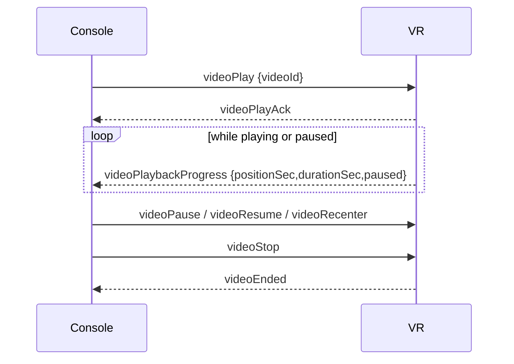

# Immersive Video: Shared Contract (Step 1)

**Status:** Accepted (VR team sign-off pending; changes return as a new ticket). Decisions recorded in [ADR 0009](../adr/0009-headset-owned-video-library-mirror.md) and [ADR 0010](../adr/0010-immersive-video-cdn-byte-path-relay-control-path.md).  
**Applies to:** `packages/shared` (event map + payload types), `services/socket` (relay registration), VR client  
**Scope:** This document is the wire contract between the console and the VR headset for the 180° FPV video mode (cycling / walking). It is step 1 of the implementation plan below; later steps (schema, adminboard, API, console UI) build on it and must not change it without a revision here.

Domain terms: **Immersive Video** (a catalog entry for one 180° FPV clip; `apps/adminboard/CONTEXT.md`); **Headset Library**, **Library State**, **Download Request**, **Update Available**, **Not in catalog**, and **Headset Identity** (`apps/console/CONTEXT.md`); **Library Mirror** (`DeviceVideoReport` + `DeviceVideo`) and **Download Descriptor** (`services/server/CONTEXT.md`).

## Decisions this contract encodes

| Topic            | Decision                                                                                                                                                                                                                                                                                                                                                            |
| ---------------- | ------------------------------------------------------------------------------------------------------------------------------------------------------------------------------------------------------------------------------------------------------------------------------------------------------------------------------------------------------------------- |
| Byte path        | The headset fetches a **Download Descriptor** (`GET /api/v1/device-videos/:videoId?deviceId=…`: current version, CDN URL `https://cdn.virtality.app/<objectKey>`, size, SHA-256) and downloads directly from the CDN over HTTPS, resumable with `Range`. The socket carries only `videoId`; neither the platform API nor the socket relay ever carries video bytes. |
| Control path     | Console → VR commands and VR → console reports travel over the existing Socket.IO relay, in the device room (`roomCode = Device.deviceId`, the Headset Identity). The relay stays a dumb forwarder; no new server-side logic.                                                                                                                                       |
| Who initiates    | Only the physio, from the console, with the file size visible. **No auto-download, no manifest polling, no preload.** The single autonomous headset behaviour is silently finishing a `downloading` `.part` it was already asked for (after wifi loss, sleep, or relaunch). A `paused` `.part` is never resumed without a console command.                          |
| Headset UI       | None beyond a passive progress indicator. All state, errors, and playback controls are on the console.                                                                                                                                                                                                                                                              |
| Source of truth  | The headset's disk. The **headset** reports its Library State to the API (`PUT /api/v1/device-videos`) at every state transition, keeping the **Library Mirror** (`DeviceVideoReport` + `DeviceVideo` rows keyed by Headset Identity, not `Device.id`) that the console reads only when the headset is offline. The console never writes the Library Mirror.        |
| Mirror auth      | Unauthenticated in v1, like `POST /api/v1/device-pairing/claim`: the mirror write and the Download Descriptor read trust the **Headset Identity** and require it to be paired to a non-deleted Device. No rate limit in v1. A pairing-issued device token can be dropped in later without changing the payloads.                                                    |
| Encoding         | No encoding, layout or codec constraint on the catalog or the upload in v1; the schema carries no format field. The adminboard accepts `mp4, m4v, mov, webm, mkv` and the object key keeps the picked extension. Playback compatibility is the VR team's and content team's concern (VR doc §5).                                                                    |
| Program sessions | A video cannot play while a program session is active on the same headset, and a program session cannot start while a video is playing. The console gates both (lifecycle §4).                                                                                                                                                                                      |
| Session tracking | **None in v1.** Playback is a live tool; no `PatientSession` row, no `SessionData`, no history.                                                                                                                                                                                                                                                                     |
| URL access       | Public CDN URL in v1. The URL is minted by the Download Descriptor endpoint, never by the console; the headset re-fetches the descriptor on 403/410. A presigned URL can be introduced later as a server-only change.                                                                                                                                               |

## Implementation plan (overview)

1. **Shared contract**: this document. `VIDEO_EVENT`, `VIDEO_RELAY`, payload types in `packages/shared/src/types/socket-events.ts`; register in `services/socket`.
2. **Schema**: `ImmersiveVideo` catalog and the Library Mirror (`DeviceVideoReport`, `DeviceVideo`) in `packages/db`.
3. **Adminboard**: catalog management and multi-GB upload. The adminboard never talks to S3: uploads pass through `services/server` (server-owned multipart, 64 MiB parts).
4. **API**: console (oRPC): `immersiveVideo.list` (no `url`/`checksum`), `deviceVideo.listForUser`. Headset (Hono, `services/server/src/routes/device-videos.ts`): `PUT /api/v1/device-videos` (full Library State upsert for one Headset Identity); `GET /api/v1/device-videos/:videoId` (Download Descriptor).
5. **Console: library management**: per-device video list on `/devices`.
6. **Console: FPV launch panel**: patient dashboard mode with playback controls.
7. **Infra**: CDN `Range` passthrough (verified, no change), bucket prefix convention, `AbortIncompleteMultipartUpload` lifecycle rule.
8. **VR client**: download engine and playback per the requirements below; detailed in `immersive-video-vr-client.md`.

## Event map

All events are relayed unchanged to the other peer in the room. Names are the wire strings; keys are the `RelayEventMap` entries.

### Console → VR

| Key                   | Wire name                  | Payload            | Notes                                                                                                                                                                                                                                                                             |
| --------------------- | -------------------------- | ------------------ | --------------------------------------------------------------------------------------------------------------------------------------------------------------------------------------------------------------------------------------------------------------------------------- |
| `LibraryStateRequest` | `videoLibraryStateRequest` | none               | Sent on every console (re)connect to the room. VR must answer with `LibraryState`.                                                                                                                                                                                                |
| `DownloadStart`       | `videoDownloadStart`       | `VideoIdPayload`   | Queue a download, or resume a `paused` one. The headset fetches the **Download Descriptor** (`GET /api/v1/device-videos/:videoId`) for the current version, URL, size and checksum. Idempotent: already `ready` at the descriptor's version → ack + immediate `DownloadComplete`. |
| `DownloadPause`       | `videoDownloadPause`       | `VideoIdPayload`   | Abort the transfer, keep the `.part`, status becomes `paused`. Not auto-resumed.                                                                                                                                                                                                  |
| `DownloadCancel`      | `videoDownloadCancel`      | `VideoIdPayload`   | Abort (running, queued, or paused) and discard the `.part`.                                                                                                                                                                                                                       |
| `Delete`              | `videoDelete`              | `VideoIdPayload`   | Remove the final file (and any `.part`).                                                                                                                                                                                                                                          |
| `Play`                | `videoPlay`                | `VideoPlayPayload` | Start playback of a `ready` video from the beginning.                                                                                                                                                                                                                             |
| `Pause`               | `videoPause`               | none               |                                                                                                                                                                                                                                                                                   |
| `Resume`              | `videoResume`              | none               |                                                                                                                                                                                                                                                                                   |
| `Stop`                | `videoStop`                | none               | Return the headset to its idle scene.                                                                                                                                                                                                                                             |
| `Recenter`            | `videoRecenter`            | none               | Re-align the 180° sphere to the patient's current forward direction.                                                                                                                                                                                                              |

### VR → Console

| Key                | Wire name               | Payload                        | Notes                                                                                                                                                                                             |
| ------------------ | ----------------------- | ------------------------------ | ------------------------------------------------------------------------------------------------------------------------------------------------------------------------------------------------- |
| `LibraryState`     | `videoLibraryState`     | `VideoLibraryStatePayload`     | Full Library State. Also sent unsolicited on VR (re)connect if a console is in the room.                                                                                                          |
| `DownloadAck`      | `videoDownloadAck`      | `VideoIdPayload`               | Download accepted and queued. Console times out at 5 s without this.                                                                                                                              |
| `DownloadProgress` | `videoDownloadProgress` | `VideoDownloadProgressPayload` | Throttled headset-side to **at most 1 per second** per video. `stalled: true` while retrying a lost connection.                                                                                   |
| `DownloadComplete` | `videoDownloadComplete` | `VideoDownloadCompletePayload` | Emitted after checksum verification and atomic rename.                                                                                                                                            |
| `DownloadFailed`   | `videoDownloadFailed`   | `VideoDownloadFailedPayload`   | Terminal for this request. The `.part` is kept for `url_expired` only (after the headset has already refreshed the descriptor once). Transient network loss is **not** a failure (see `stalled`). |
| `DownloadPaused`   | `videoDownloadPaused`   | `VideoDownloadPausedPayload`   | `DownloadPause` honoured; carries the kept byte count.                                                                                                                                            |
| `PlayAck`          | `videoPlayAck`          | `VideoIdPayload`               | Playback started.                                                                                                                                                                                 |
| `PlaybackProgress` | `videoPlaybackProgress` | `VideoPlaybackProgressPayload` | At most 1 per second while playing **and while paused** (`paused: true`); this is how a (re)joining console re-attaches its controls.                                                             |
| `Ended`            | `videoEnded`            | `VideoIdPayload`               | Video reached its end, or `Stop` was honoured.                                                                                                                                                    |

## Payload types

```ts
export type VideoIdPayload = {
  videoId: string
}

export const VIDEO_DEVICE_STATUS = {
  Absent: 'absent',
  Downloading: 'downloading',
  /** Physio paused it. `.part` kept; resumed only by a new `DownloadStart`. */
  Paused: 'paused',
  Ready: 'ready',
  Failed: 'failed',
} as const

export type VideoDeviceStatus =
  (typeof VIDEO_DEVICE_STATUS)[keyof typeof VIDEO_DEVICE_STATUS]

export type VideoLibraryEntry = {
  videoId: string
  status: VideoDeviceStatus
  /** Version of the file on disk. Present when status is `ready`; also for a resumable `.part`. */
  version?: number
  /** Present while `downloading` or `paused`. */
  bytesDownloaded?: number
  sizeBytes?: number
  /** Present when status is `failed`. */
  reason?: VideoDownloadFailureReason
}

export type VideoLibraryStatePayload = {
  videos: VideoLibraryEntry[]
  /** Free bytes on the volume that stores videos. Console uses this to warn before a download. */
  freeBytes: number
}

/**
 * Body of `PUT /api/v1/device-videos` (headset → API). Same shape as the socket
 * payload plus the Headset Identity; the server replaces all DeviceVideo rows
 * for that Headset Identity with `videos` and stamps `reportedAt`.
 */
export type DeviceVideoReportBody = VideoLibraryStatePayload & {
  deviceId: string
}

export type VideoDownloadProgressPayload = {
  videoId: string
  bytesDownloaded: number
  sizeBytes: number
  /** True while the headset is retrying after a lost connection; bytes are not advancing. */
  stalled: boolean
}

export type VideoDownloadPausedPayload = {
  videoId: string
  bytesDownloaded: number
}

export type VideoDownloadCompletePayload = {
  videoId: string
  version: number
}

export const VIDEO_DOWNLOAD_FAILURE_REASON = {
  InsufficientStorage: 'insufficient_storage',
  /** Non-recoverable transport or I/O error (4xx other than 403/410, disk I/O). Transient loss is retried, not failed. */
  Network: 'network',
  ChecksumMismatch: 'checksum_mismatch',
  Cancelled: 'cancelled',
  /** CDN still answered 403/410 after the headset refreshed the Download Descriptor once. `.part` kept. */
  UrlExpired: 'url_expired',
  /** The API returned 404 for the descriptor: video unpublished/deleted, or this headset is no longer paired. */
  Unavailable: 'unavailable',
} as const

export type VideoDownloadFailureReason =
  (typeof VIDEO_DOWNLOAD_FAILURE_REASON)[keyof typeof VIDEO_DOWNLOAD_FAILURE_REASON]

export type VideoDownloadFailedPayload = {
  videoId: string
  reason: VideoDownloadFailureReason
}

export type VideoPlayPayload = VideoIdPayload

export type VideoPlaybackProgressPayload = {
  videoId: string
  positionSec: number
  durationSec: number
  /** True while playback is paused; progress keeps emitting so a (re)joining console can re-attach. */
  paused: boolean
}
```

### `RelayEventMap` entries

```ts
export const VIDEO_EVENT = {
  LibraryStateRequest: 'videoLibraryStateRequest',
  LibraryState: 'videoLibraryState',
  DownloadStart: 'videoDownloadStart',
  DownloadAck: 'videoDownloadAck',
  DownloadProgress: 'videoDownloadProgress',
  DownloadComplete: 'videoDownloadComplete',
  DownloadFailed: 'videoDownloadFailed',
  DownloadPause: 'videoDownloadPause',
  DownloadPaused: 'videoDownloadPaused',
  DownloadCancel: 'videoDownloadCancel',
  Delete: 'videoDelete',
  Play: 'videoPlay',
  PlayAck: 'videoPlayAck',
  Pause: 'videoPause',
  Resume: 'videoResume',
  Stop: 'videoStop',
  Recenter: 'videoRecenter',
  PlaybackProgress: 'videoPlaybackProgress',
  Ended: 'videoEnded',
} as const

export const VIDEO_RELAY: RelayEventMap = {
  LibraryStateRequest: {
    name: VIDEO_EVENT.LibraryStateRequest,
    payload: false,
  },
  LibraryState: { name: VIDEO_EVENT.LibraryState, payload: true },
  DownloadStart: { name: VIDEO_EVENT.DownloadStart, payload: true },
  DownloadAck: { name: VIDEO_EVENT.DownloadAck, payload: true },
  DownloadProgress: { name: VIDEO_EVENT.DownloadProgress, payload: true },
  DownloadComplete: { name: VIDEO_EVENT.DownloadComplete, payload: true },
  DownloadFailed: { name: VIDEO_EVENT.DownloadFailed, payload: true },
  DownloadPause: { name: VIDEO_EVENT.DownloadPause, payload: true },
  DownloadPaused: { name: VIDEO_EVENT.DownloadPaused, payload: true },
  DownloadCancel: { name: VIDEO_EVENT.DownloadCancel, payload: true },
  Delete: { name: VIDEO_EVENT.Delete, payload: true },
  Play: { name: VIDEO_EVENT.Play, payload: true },
  PlayAck: { name: VIDEO_EVENT.PlayAck, payload: true },
  Pause: { name: VIDEO_EVENT.Pause, payload: false },
  Resume: { name: VIDEO_EVENT.Resume, payload: false },
  Stop: { name: VIDEO_EVENT.Stop, payload: false },
  Recenter: { name: VIDEO_EVENT.Recenter, payload: false },
  PlaybackProgress: { name: VIDEO_EVENT.PlaybackProgress, payload: true },
  Ended: { name: VIDEO_EVENT.Ended, payload: true },
} as const
```

Registration in `services/socket/src/sockets/device-event-controller.ts` is one line in `registerSocketHandlers`: `registerRelayEvents(VIDEO_RELAY, roomCode, socket)`. Add a relay test alongside the program relay tests.

## Sequences

### Download

```mermaid
sequenceDiagram
    participant Physio
    participant Console
    participant Relay as Socket relay
    participant VR
    participant API
    participant CDN

    Console->>Relay: videoLibraryStateRequest
    Relay->>VR: videoLibraryStateRequest
    VR-->>Console: videoLibraryState {videos, freeBytes}
    Physio->>Console: click Download (size shown)
    Console->>Relay: videoDownloadStart {videoId}
    Relay->>VR: videoDownloadStart
    VR-->>Console: videoDownloadAck
    VR->>API: GET /api/v1/device-videos/{videoId}?deviceId=…
    API-->>VR: {version,url,sizeBytes,checksum}
    VR->>API: PUT /api/v1/device-videos (status: downloading)
    loop until complete
        VR->>CDN: GET url (Range: bytes=N-)
        CDN-->>VR: bytes
        VR-->>Console: videoDownloadProgress (≤1/s)
    end
    opt wifi drop / sleep
        VR-->>Console: videoDownloadProgress {stalled: true}
        Note over VR: retry with backoff (cap 30 s), forever;\nresume from .part offset
    end
    opt physio pauses
        Console->>VR: videoDownloadPause
        VR-->>Console: videoDownloadPaused {bytesDownloaded}
        Note over VR: .part kept, not auto-resumed
        Console->>VR: videoDownloadStart {videoId} → re-fetches descriptor, resumes
    end
    VR->>VR: verify SHA-256, rename .part → final
    VR-->>Console: videoDownloadComplete {videoId,version}
    VR->>API: PUT /api/v1/device-videos {deviceId, videos, freeBytes}
```

### Playback



## Console obligations

- Gate every command on **room membership** (`RoomComplete` → enabled, `MemberLeft`/disconnect → disabled). Presence polling only selects copy and data source while no room exists; a stale poll never disables a live panel. Never show a Download or Play button as enabled when the headset is not in the room.
- Wait for `DownloadAck` / `PlayAck` with a 5 s timeout. On timeout, or if the room goes incomplete before the ack, open the `HeadsetDidNotConfirmDialog` (reasons: didn't respond / disconnected) and re-request Library State on rejoin. Never re-send the command automatically.
- Show `sizeBytes` (from `immersiveVideo.list`) on every Download button and warn when `sizeBytes > freeBytes` before sending.
- Map `VideoDownloadFailureReason` to physio-actionable copy:
  - `insufficient_storage` → "Headset storage is full. Delete videos from this page to free space."
  - `network` → "The download failed. Try again." (rare; transient loss shows as stalled, not failed)
  - `checksum_mismatch` → "The file was corrupted in transfer. Try again."
  - `cancelled` → silent.
  - `url_expired` → `network` copy ("The download failed. Try again."); Download offered (a click resumes, the `.part` is kept); no console-side URL handling.
  - `unavailable` → "This video is no longer available." unless the row is **Not in catalog**, which takes precedence.
- During a download show **Pause** and **Cancel**; on a `paused` row show **Resume** (sends the same `DownloadStart`) and **Cancel**. While `stalled` show "Waiting for headset connection…" in place of the rate; when the headset leaves the room show the same copy from the last known bytes.
- Never write the Library Mirror. While the headset is in the room, render from socket `LibraryState`; when it is offline, render `deviceVideo.listForUser` read-only, labelled "as of <reportedAt>".
- Enable Play only for entries with `status === 'ready'` and `version` equal to the catalog version. Show "Update available" (not an error) when the version is older. An entry whose `videoId` is not in `immersiveVideo.list` renders as **Not in catalog**: Play disabled, Delete offered; the console never auto-sends `videoDelete`.
- On every `roomComplete` wait 2 s for a `videoPlaybackProgress`: `paused: false` → re-attach as Playing, `paused: true` → as Paused, nothing → Idle.
- Program-session gate: the Immersive Video dashboard mode can be entered only while no program session is active on that headset, and cannot be left while playback is Starting/Playing/Paused. While a video is active on the headset (a `videoPlaybackProgress` within the last 3 s, or local Starting), Start Session is disabled.

## VR client obligations

- Stream to `videos/{videoId}.part`; never buffer a whole file in memory.
- Fetch the Download Descriptor on every `DownloadStart`, ack first; persist it in the manifest so silent resumes need no API call.
- A `404` from the descriptor endpoint is `Failed(unavailable)`; an unreachable API is treated like transient loss (stalled, retry).
- Verify SHA-256 (hash while streaming) and atomically rename to `videos/{videoId}.{ext}` (extension from the descriptor URL) only on match.
- Resume: if a `.part` exists for the requested `videoId` **and the same `version` as the freshly fetched descriptor**, re-hash the prefix and send `Range: bytes={partSize}-`. CloudFront forwards `Range` to S3 and answers `206`; keep a defensive branch that truncates and restarts on a `200`, but do not expect it. A different version discards the `.part`.
- Transient connection loss (wifi drop, DNS, timeout, reset) is **never** a failure: keep `downloading`, retry with exponential backoff capped at 30 s for as long as the app is alive, and emit `DownloadProgress {stalled: true}` while a console is present. `Failed(network)` is reserved for non-recoverable errors.
- On app suspend (sleep) flush the `.part` and manifest; on wake or launch resume every `downloading` entry silently. Never resume a `paused` entry without a `DownloadStart`.
- `DownloadPause`: abort the transfer within 1 s, keep the `.part`, set `paused`, reply `DownloadPaused`. A `DownloadStart` for a `paused` video resumes it.
- Pre-check free space; fail fast with `insufficient_storage` rather than at 90 %.
- One download at a time; further `DownloadStart` requests queue in order. Progress events are per-video.
- On app launch, silently continue any `.part` from a previous run (this is finishing an existing request, not a new one). Do not start anything else without a `DownloadStart`.
- A socket disconnect must **not** abort an in-flight HTTP download. When the socket reconnects and a console is present, send `LibraryState` unsolicited.
- A regular program launched while a download is running must run normally; the download continues (or pauses and resumes) in the background.
- Throttle `DownloadProgress` and `PlaybackProgress` to 1/s. `PlaybackProgress` keeps emitting while paused, with `paused: true`.
- Respond to `LibraryStateRequest` within 2 s.
- Report Library State to the API with `PUT /api/v1/device-videos` (the same `VideoLibraryStatePayload` plus the Headset Identity as `deviceId`) once on app launch and at every transition: download started, paused, completed, failed, video deleted. **Never** on progress ticks; progress is socket-only. If the request fails, keep the latest snapshot and retry on the next transition or network change; the socket path makes this non-urgent.
- No headset-side UI for this feature beyond a passive progress indicator. No menus, no dialogs, no confirmations.

## Out of scope for v1

- Session/history tracking and any telemetry from playback.
- Presigned or otherwise gated URLs (a server-only change: the Download Descriptor endpoint mints the URL and the headset already refreshes on 403/410).
- Headset-pulled manifests or any autonomous download.
- Playback speed or other therapeutic parameters.
- Entitlement gating, rate limiting and device-token auth for the headset-facing routes.
