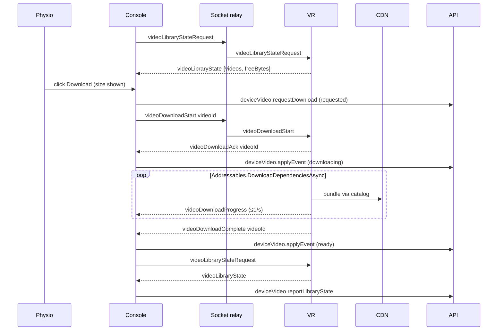
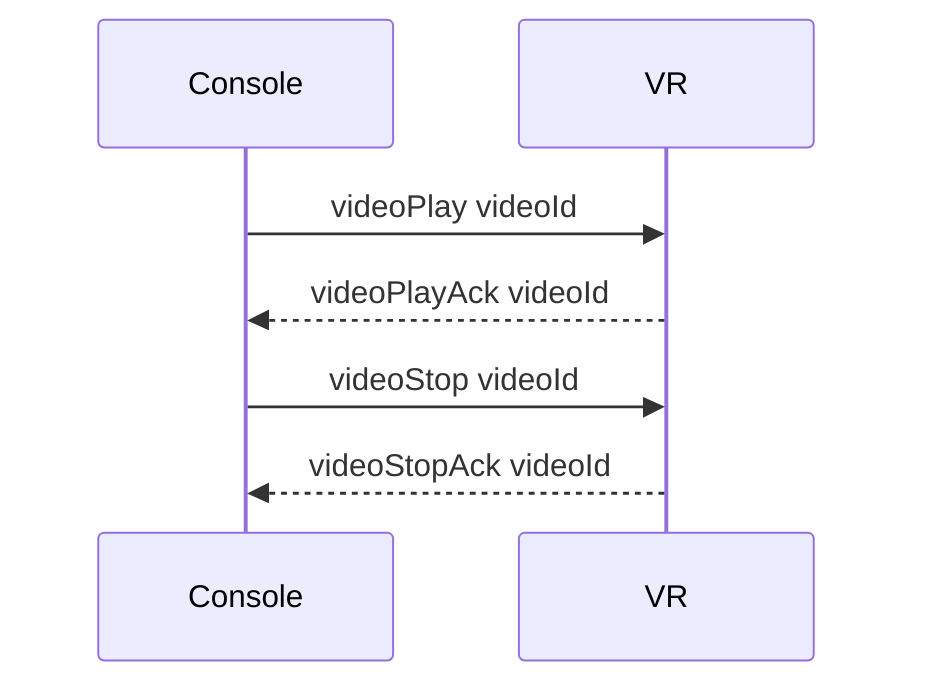

# Immersive Video: console ↔ headset contract

**Status:** describes what the headset app (`Virtality-app/Virtality`, `Run_Cycle`) implements today and what the platform sends and stores against it. Decisions in [ADR 0009](../adr/0009-immersive-video-addressables-bytes-relay-control-console-mirror.md).
**Applies to:** `packages/shared` (event map + payload types), `services/socket` (relay registration), `apps/console`, `packages/orpc` (`deviceVideo.*`), VR client.

Domain terms: **Immersive Video**, **Video ID**, **File Kind**, **Addressables Catalog** (`apps/adminboard/CONTEXT.md`); **Headset Library**, **Library State**, **Headset Payload**, **Download Request**, **Requested**, **Not in catalog** (`apps/console/CONTEXT.md`); **Library Mirror** (`services/server/CONTEXT.md`).

## Shape of the feature

| Topic            | Decision                                                                                                                                                                                                                                                                                                                                       |
| ---------------- | ---------------------------------------------------------------------------------------------------------------------------------------------------------------------------------------------------------------------------------------------------------------------------------------------------------------------------------------------- |
| Byte path        | Unity Addressables. `https://cdn.virtality.app/immersive-videos` is `Remote.LoadPath`; bundles keep their Unity filename; the admin uploads the catalog pair next to them. The headset never calls the platform API for video. No `Range`, no `.part`, no descriptor, no version.                                                              |
| Control path     | The existing Socket.IO relay, in the device room (`roomCode = Device.deviceId`). The relay forwards unchanged; no server-side state.                                                                                                                                                                                                           |
| Who initiates    | Only the physio, from the console, with the file size shown. No auto-download, no preload.                                                                                                                                                                                                                                                     |
| Source of truth  | The headset's disk. It reports **Library State** on request; the **console** writes the **Library Mirror** from what it hears and reads it when the headset is offline. A **Download Request** is written as `requested` before the headset answers.                                                                                           |
| Video ID         | Chosen by the admin on the first upload (`^[a-z0-9][a-z0-9._-]{0,63}$`, unique) or generated; fixed once a file has verified. It is the `videoId` on every event and the bundle's Addressables address. (Open: the committed headset build resolves ids against a hard-wired `VideoDatabase.asset`, so today it must be the Unity asset GUID.) |
| Program gate     | The dashboard mode selector is locked while a video is Starting/Playing/Paused, and Immersive Video mode cannot be entered while a program session is active. No other mode ever has a video running.                                                                                                                                          |
| Session tracking | None. Playback is a live tool.                                                                                                                                                                                                                                                                                                                 |

## Wire framing

- **Single-id events** carry the `videoId` as the first Socket.IO argument, a bare string: `socket.emit('videoPlay', videoId)`. The headset reads argument 0 (`JArray.Parse(data)[0].ToString()`); an object or a wrapped array there is unusable to it.
- **Object payloads from the headset** arrive as the JSON _text_ the headset serialised (`SendSocketCall(FunctionsSent, string data)`), camelCase, arrays as arrays. This is the same convention every other VR feature uses (ADR 0003). The relay forwards the string untouched; `subscribe()` in `apps/console/lib/device-event-controller.ts` parses it before any handler runs. Console code never reads a headset event through a raw `socket.on`.
- **Object payloads from the console** are emitted as objects. No console → VR video command carries an object today.

## Event map

Keys are `VIDEO_EVENT` / `VIDEO_RELAY` entries in `packages/shared/src/types/socket-events.ts`; wire names are the strings. "Headset" says whether the committed `Run_Cycle` build handles or sends it.

### Console → VR

| Key                   | Wire name                  | Payload     | Headset             | Notes                                                                                                            |
| --------------------- | -------------------------- | ----------- | ------------------- | ---------------------------------------------------------------------------------------------------------------- |
| `LibraryStateRequest` | `videoLibraryStateRequest` | none        | handled             | Sent on every console (re)connect to the room and after `videoDownloadComplete`. VR answers with `LibraryState`. |
| `DownloadStart`       | `videoDownloadStart`       | `[videoId]` | handled             | Queue a download. Unknown id → `videoDownloadFailed {unavailable}`.                                              |
| `DownloadPause`       | `videoDownloadPause`       | `[videoId]` | **not handled**     | Control hidden on the console until a VR build handles it.                                                       |
| `DownloadCancel`      | `videoDownloadCancel`      | `[videoId]` | acked, not honoured | The console uses it to withdraw a `requested` row; a running download is not stopped.                            |
| `Delete`              | `videoDelete`              | `[videoId]` | handled             | Clears the bundle from the Addressables cache.                                                                   |
| `Play`                | `videoPlay`                | `[videoId]` | handled             | Start playback of a `ready` video from the beginning.                                                            |
| `Pause`               | `videoPause`               | none        | **not handled**     | One event toggles pause and resume, like the program's pause. Control hidden until handled.                      |
| `Stop`                | `videoStop`                | `[videoId]` | handled             | Return the headset to its idle scene; the id is checked against the running clip.                                |

### VR → Console

| Key                 | Wire name                | Payload                        | Headset      | Notes                                                                                                                        |
| ------------------- | ------------------------ | ------------------------------ | ------------ | ---------------------------------------------------------------------------------------------------------------------------- |
| `LibraryState`      | `videoLibraryState`      | `VideoLibraryStatePayload`     | sent         | Only on request. Lists downloaded videos, each as `{videoId, status: "ready"}`; `freeBytes` from `StatFs` (0 in the Editor). |
| `DownloadAck`       | `videoDownloadAck`       | `[videoId]`                    | sent         | Console times out at 5 s without it. For an unknown id the headset sends `videoDownloadFailed` first.                        |
| `DownloadProgress`  | `videoDownloadProgress`  | `VideoDownloadProgressPayload` | sent         | `sizeBytes` is `bytesDownloaded / PercentComplete`, an estimate. An already-cached bundle ticks `0/0`.                       |
| `DownloadComplete`  | `videoDownloadComplete`  | `[videoId]`                    | sent         | The console marks the row `ready` and re-requests Library State.                                                             |
| `DownloadFailed`    | `videoDownloadFailed`    | `VideoDownloadFailedPayload`   | sent         | Reasons today: `unavailable`, `network`.                                                                                     |
| `DownloadPaused`    | `videoDownloadPaused`    | `VideoDownloadPausedPayload`   | **not sent** |                                                                                                                              |
| `DownloadCancelAck` | `videoDownloadCancelAck` | `[videoId]`                    | sent         | The console removes the row.                                                                                                 |
| `DeleteAck`         | `videoDeleteAck`         | `[videoId]`                    | sent         | The console removes the row. (`videoDeleteComplete` / `videoDeleteFailed` are also sent; not relayed.)                       |
| `PlayAck`           | `videoPlayAck`           | `[videoId]`                    | sent         | Sent on receipt, before playback starts.                                                                                     |
| `PlaybackProgress`  | `videoPlaybackProgress`  | `VideoPlaybackProgressPayload` | **not sent** | When sent: ≤1/s while playing and while paused, so a rejoining console can re-attach.                                        |
| `Ended`             | `videoEnded`             | none                           | **not sent** | Until sent, the console only leaves Playing on `videoStopAck`.                                                               |
| `StopAck`           | `videoStopAck`           | `[videoId]`                    | sent         | The console returns to Idle; a stale ack for another video is ignored.                                                       |

Payload types are the source in `packages/shared/src/types/socket-events.ts`; the doc does not repeat them.

## Sequences

### Download

### Playback

## Console obligations

- Gate every command on room membership (`RoomComplete` → enabled, `MemberLeft`/disconnect → disabled). Presence polling only selects copy while no room exists. Never show Download or Play enabled when the headset is not in the room.
- Wait for `DownloadAck` / `PlayAck` with a 5 s timeout. On timeout, or if the room goes incomplete first, open the `HeadsetDidNotConfirmDialog`. Never re-send `videoPlay` automatically.
- A Download Request the headset never acknowledged survives as a `requested` row. Once the headset is in the room and has reported its Library State, re-send `videoDownloadStart` for every `requested` row it does not report: one at a time, at most once per connection, quietly.
- Show `sizeBytes` from the catalog on every Download button and warn when it exceeds `freeBytes`.
- Draw download progress from `bytesDownloaded` clamped to the catalog size; never store or show a byte count for a `ready` row.
- Map failure reasons: `unavailable` → "This video is no longer available." (unless the row is **Not in catalog**, which wins); `network` and `url_expired` → "The download failed. Try again."; `insufficient_storage` → "Not enough space on the headset…"; `checksum_mismatch` → "The file was corrupted in transfer. Try again."
- Enable Play only for `ready` entries in the catalog. An entry whose `videoId` is not in `immersiveVideo.list` renders as **Not in catalog**: Play disabled, Delete offered; the console never auto-sends `videoDelete`.
- Listen and write the mirror only in Immersive Video mode on the patient dashboard, and on `/vr-video`. The mode selector is locked while playback is Starting/Playing/Paused.
- Hide the controls whose command the headset does not handle (`apps/console/lib/immersive-video-headset-support.ts`).

## Library Mirror (`packages/orpc/src/procedures/device-video-mirror.ts`)

- `reportLibraryState`: the set of rows becomes what the headset listed; an in-flight row keeps byte counts the report omits; `requested` rows the headset does not mention survive; stamps `reportedAt` and `freeBytes`.
- `requestDownload`: creates a `requested` row (or re-marks a `failed` one); never downgrades a live download; creates the header undated if missing and otherwise leaves it alone.
- `applyEvent`: patches one row; a `ready` row drops `bytesDownloaded`/`sizeBytes`; stamps `reportedAt`.
- `remove`: deletes one row (cancel ack, delete ack, or a withdrawn request); the header keeps its date.
- Every write is scoped to a headset on one of the caller's non-deleted Devices; a refusal is logged server-side and the console toasts only a rejected Download Request.
- Retention: a `DeviceVideoReport` whose identity is on no live Device and whose `reportedAt` is null or older than 180 days is deleted nightly.

## Out of scope

- Any headset-facing HTTP endpoint; pause/resume/cancel of an Addressables download; re-download of replaced bundles (the VR app owns catalog refresh).
- Session or history tracking, telemetry from playback, playback speed or other therapeutic parameters.
- Presigned or gated CDN URLs, entitlement gating, rate limiting.
